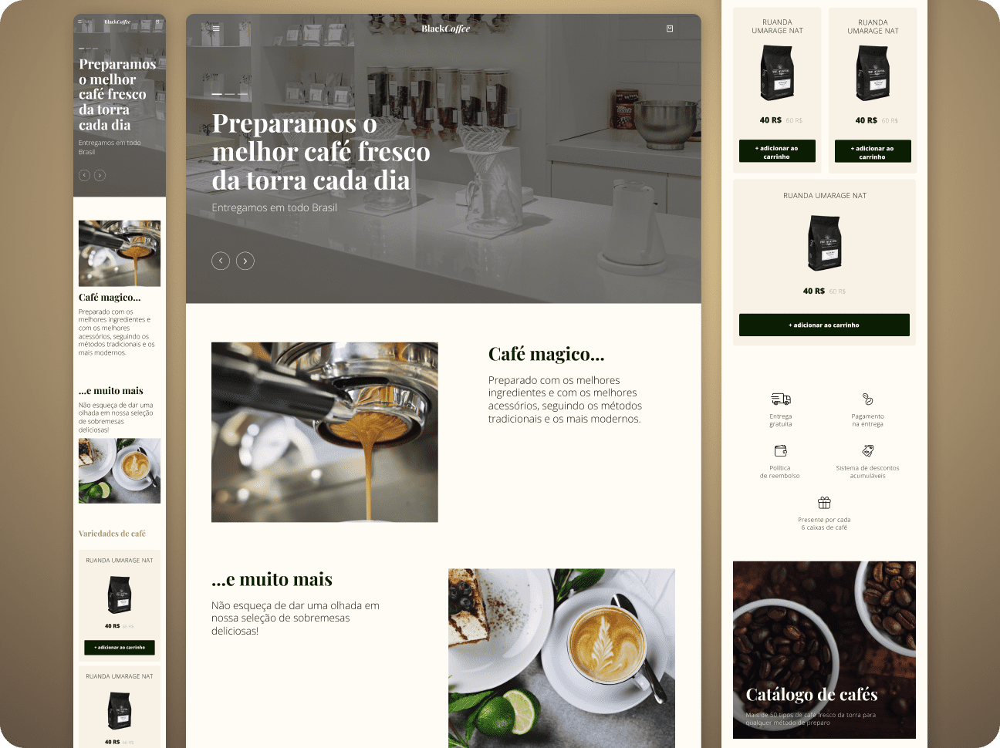

# 💻 Website Adaptativo Black Coffee ☕

Este é um projeto desenvolvido como parte da Tarefa 2 do curso de Desenvolvimento de Layout em Front-end da Mentorama. 

 

## 👨🏾‍💻 Desafio do Projeto

O objetivo desta tarefa é criar um site responsivo utilizando HTML5 e CSS3, fazendo uso do Flexbox para tornar o layout adaptável a diferentes dispositivos. O projeto consiste no desenvolvimento de um site a partir de um protótipo do Figma. O layout deve ser capaz de se ajustar automaticamente para diferentes tamanhos de tela, proporcionando uma boa experiência do usuário em dispositivos como: desktop, tablet e mobile.

 

## 🚀 Tecnologias Utilizadas

- HTML5
- CSS3 (com Flexbox)

 

## 🏆 Aprendizado 

- Responsividade
- Flexbox

 

## 📸 Screenshots

## 🔗 Projeto Hospedado no Vercel
Este projeto está disponível para visualização online através do Vercel. Você pode acessá-lo através do link: